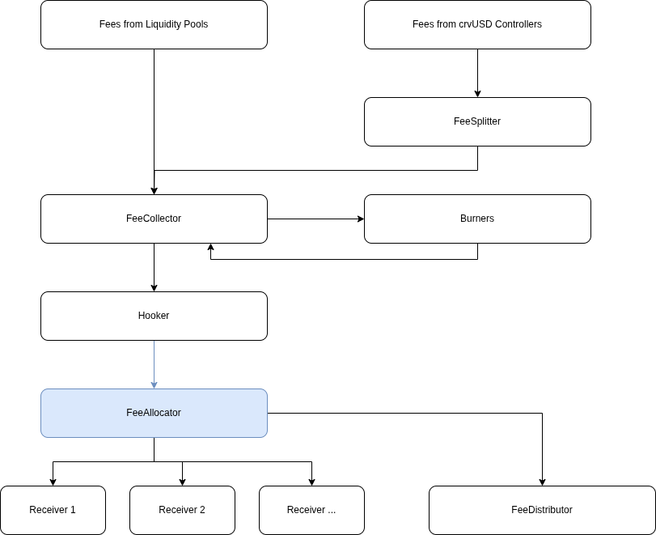

# Curve Fee Allocator

## Overview

The FeeAllocator contract serves as an intermediary layer between the [`Hooker`](https://docs.curve.finance/fees/Hooker/) and [`FeeDistributor`](https://docs.curve.finance/fees/FeeDistributor/) which redistributes fees accrued by Curve to holders of the veCRV token.

It allows protocol fees to be split among multiple receivers before the remainder flows to veCRV holders. This allows the DAO to designate different avenues where a portion of fees can be redistributed, for instance to fund service providers such as Swiss Stake, or accumulate an insurance fund for bad debt.

The share of fees that can go to receivers is capped at 50%, meaning that half of protocol revenue will always flow back to veCRV. If the amount of fees redirected to receivers is lower than 50%, the remainder of fees will also flow to veCRV stakers.

A maximum of 10 receivers can be added.

## Architecture

## Flow

Currently when calling `forward()` on the `FeeCollector` during the `FORWARD` period of the week, collected fees accumulated in the contract from the burning process are transferred to the `Hooker`. The `duty_act` function on the `Hooker` is called, executing the configured hook.

The `Hooker` on mainnet has one single hook targeting the [`FeeDistributor`](https://etherscan.io/address/0xD16d5eC345Dd86Fb63C6a9C43c517210F1027914#code)